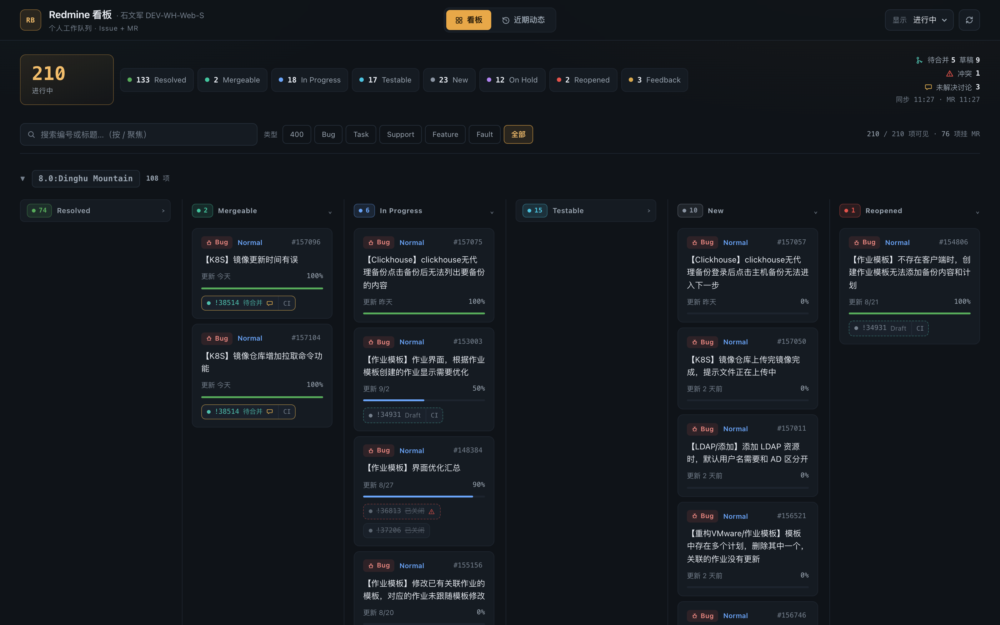
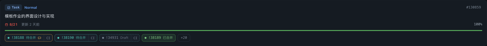
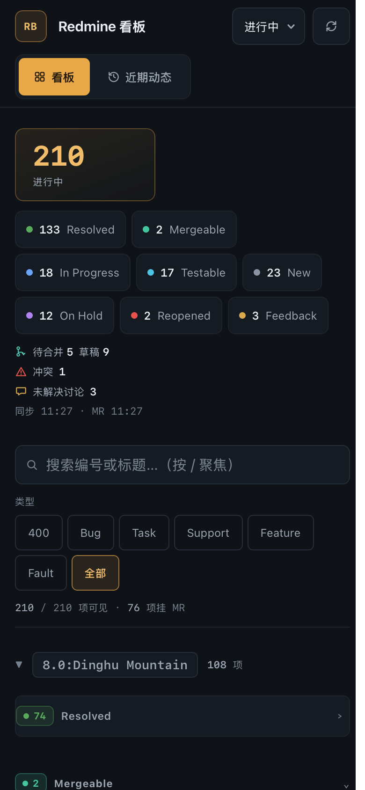

# Redmine 个人看板

一个轻量的可视化看板，聚合你在 Redmine 上的任务/Bug，按版本分组、状态分类展示，并自动关联你在 GitLab 上的 Merge Request 状态。替代慢且难用的 Redmine 网页筛选。







## 特性

- 📋 **按版本分组 + 状态分列**：一眼看清每个版本下各状态的任务分布
- 🔀 **GitLab MR 状态同步**：issue 卡片直接显示关联 MR 的待合并/草稿/已合并/冲突状态，点击直达 MR 页面；opened 状态的 MR 可点 `CI` 按需查询流水线结果
- 🎨 **状态颜色区分**：In Progress / Reopened / Resolved / Feedback 等各有配色
- 🕐 **近期动态**：时间线展示你最近更新过的 issue（含 MR 徽标）
- ⚡ **性能**：Redmine 分页并发拉取、聚合结果内存缓存、MR 独立请求不阻塞首屏、折叠列懒渲染、每 5 分钟自动同步
- 📚 **完整分页**：自动读取 Redmine 的全部分页，搜索不会漏掉旧 issue
- 🔒 **凭据安全**：Key 只存在后端（环境变量或本地 CLI 配置），前端拿不到
- 🧩 **零依赖**：后端单文件 Node.js，前端单文件 HTML，无需 npm install
- 🔗 **点击跳转**：任意卡片点击直达 Redmine 原文
- 📱 **移动端适配**：响应式布局 + 触屏优化（40px+ 点击目标、iOS 输入框缩放与缓存兼容），手机浏览器直接访问

## 快速开始

### 方式一：零配置启动（推荐，适合自己电脑）

前提：装好 Node.js（≥14），并且本机已配置过 redmine CLI（`redmine auth login`）。GitLab MR 状态会在检测到 glab CLI 登录后自动启用，无需额外配置。

```bash
bash start.sh          # 或 macOS 直接双击「Redmine看板.command」
```

浏览器自动打开 **http://localhost:7788**。凭据从 `~/.redmine-cli.yaml` 和 glab CLI 配置自动读取，不落仓库。

### 方式二：环境变量启动

```bash
REDMINE_API_KEY=你的key node server.js
# 可选：GITLAB_URL / GITLAB_TOKEN 覆盖 GitLab 配置
```

API Key 获取方式：Redmine → 我的帐户 → 右侧「API 访问密钥」→ 显示/重置

### 给其他同事使用

1. 把仓库地址发给他，clone（或直接 zip 发目录）
2. 凭据准备，两条路任选：
   - **推荐**：装 redmine CLI 并 `redmine auth login`（之后启动脚本全自动，MR 状态需要 `glab login` 或设置 `GITLAB_TOKEN`）
   - **没有 redmine CLI 也能用**：去 Redmine → 我的帐户 → 显示 API 访问密钥，然后 `REDMINE_URL=https://你的redmine地址 REDMINE_API_KEY=你的key node server.js`
3. 启动（三平台都支持）：
   - **macOS**：双击 `Redmine看板.command`
   - **Windows**：双击 `start.bat`
   - **Linux**：`bash start.sh`
4. 每个人的凭据都读自各自电脑的本地配置（`~/.redmine-cli.yaml`、glab CLI 配置，macOS/Linux/Windows 路径均已适配），仓库里没有任何敏感信息

## 使用说明

- **看板视图**：默认显示进行中（open）的任务。右上角下拉可切换「全部 / 仅已关闭」
- **近期动态**：顶部切换标签，查看近 N 天你更新过的 issue
- **MR 徽标**：卡片下方出现 `!38287` 样式的 token 即为关联 MR；`待合并/草稿/已合并/已关闭/⚠冲突` 一目了然，点 token 打开 MR 页面，点右侧 `CI` 按需查询流水线（再点一次强制刷新）
- **刷新**：右上角同步按钮强制刷新；页面每 5 分钟在可见时自动同步
- **交互技巧**：按 `/` 快速聚焦搜索（Esc 清除）；点版本区头/状态列头折叠，折叠状态会记住（刷新不丢）；一个 issue 挂多个 MR 时默认显示前 4 个，点 `+N` 展开；页脚的 `b0910.3` 是构建号，核对版本用

## GitLab MR 关联机制

后端拉取你创建的最近 100 条 MR（含 opened + 近期 merged/closed），前端按三级规则匹配到 issue，命中任意一级即挂上徽标：

1. issue 自定义字段「分支名称」=== MR `source_branch`（精确，最可靠；若你的 Redmine 实例没有此字段，自动跳过，2/3 级匹配是通用的）
2. MR 标题中的 `Refs #N` / `Fix #N` 引用
3. 分支名中的数字 token（如 `hotfix/bug-150117-web` → 150117）

GitLab token 自动从 glab CLI 配置读取；不可用时看板正常工作，仅提示「MR 状态不可用」。可用环境变量 `GITLAB_URL` / `GITLAB_TOKEN` 覆盖。

## 性能设计

| 机制 | 说明 |
|------|------|
| 并发分页 | Redmine 分页先拉第一页拿总数，剩余页并发（上限 6），约 N×RTT → 2×RTT |
| 聚合缓存 | overview/recent 结果内存缓存 60s；`?force=1` 绕过 |
| MR 缓存 | MR 列表缓存 120s；pipeline 按需查询缓存 60s |
| 两段式渲染 | issue 先渲染，MR 数据独立请求到达后响应式补上徽标 |
| 懒渲染 | 折叠的版本/状态列不渲染卡片 DOM，展开时才创建 |
| 自动同步 | 每 5 分钟且页面可见时静默刷新，不闪骨架屏 |

## 数据规模说明

默认加载 open 状态。后端会自动处理 Redmine 的分页限制，因此搜索结果完整；切换「全部」时数据量较大，首次加载会稍慢属正常。

## 部署到服务器

本看板代码零改动即可部署到任意装了 Node.js（≥14）的服务器：

### Linux

```bash
# 1. 拷贝整个目录到服务器
scp -r redmine-dashboard/ user@server:~/

# 2. 登录服务器，配好环境变量后启动
ssh user@server
cd redmine-dashboard
REDMINE_API_KEY=你的key REDMINE_URL=https://redmine.example.com/redmine node server.js
```

常驻可用 nohup / systemd / pm2：
```bash
REDMINE_API_KEY=你的key nohup node server.js > dashboard.log 2>&1 &
# 或 pm2 start server.js --name redmine-board
```

### Windows

1. 把整个目录拷到服务器（如 `C:\redmine-dashboard`），安装 [Node.js LTS](https://nodejs.org/)
2. 凭据二选一：
   - 把自己电脑上的 `~/.redmine-cli.yaml` 拷到该机 `C:\Users\<用户名>\.redmine-cli.yaml`（MR 状态还需设置环境变量 `GITLAB_TOKEN`，或安装 glab CLI 并登录）
   - 或直接设环境变量 `REDMINE_URL` / `REDMINE_API_KEY` / `GITLAB_TOKEN`
3. 防火墙放行端口：`netsh advfirewall firewall add rule name="redmine-board" dir=in action=allow protocol=TCP localport=7788`
4. 启动：双击 `start.bat`（调试用）；常驻自启推荐用 [NSSM](https://nssm.cc/) 注册为 Windows 服务：
   ```bat
   nssm install redmine-board "C:\Program Files\nodejs\node.exe" "C:\redmine-dashboard\server.js"
   nssm set redmine-board AppDirectory C:\redmine-dashboard
   nssm set redmine-board AppEnvironmentExtra REDMINE_URL=https://redmine.example.com/redmine REDMINE_API_KEY=你的key GITLAB_TOKEN=你的token
   nssm start redmine-board
   ```

绑定的是 `0.0.0.0`，同内网的机器可直接通过 `http://服务器IP:7788` 访问。

> ⚠️ 若服务器可从公网访问，请务必加访问控制（安全组白名单 / SSH 隧道 / Nginx + Basic Auth），否则工单数据对任何能连到端口的人可见。

## 文件说明

| 文件 | 作用 |
|------|------|
| `server.js` | 后端：代理 Redmine API + 数据聚合，零 npm 依赖 |
| `index.html` | 前端：看板页面，内联样式，CDN 引入 Alpine.js |
| `.env.example` | 配置模板 |
| `README.md` | 本文件 |

## 技术栈

- **后端**：Node.js 内置模块（http/https/fs/os/path），零依赖
- **前端**：原生 HTML/CSS/JS + Alpine.js（CDN）+ 内联 SVG 图标
- **数据源**：Redmine REST API + GitLab REST API（内存缓存，无外部存储）

## 开发注意

- `*.bat` / `*.ps1` 必须保持 **CRLF** 换行：cmd.exe 解析 LF 换行的批处理会把多行粘成一行执行。已由 `.gitattributes` 锁定入库字节，但在 macOS/Linux 上编辑这些文件时请确认编辑器不会把换行转成 LF
- 启动脚本（`.command` / `start.sh`）保持 LF
- **发版时更新页脚构建号**（`b0910.3` 这类标记）：页面以 `no-store` 下发防缓存，构建号用于核对客户端（尤其手机 Safari）是否拿到最新版本
- **移动端视觉验证须用 WebKit 引擎**（如 Playwright 的 `webkit`，与 iOS Safari 同源）：Chrome 移动模拟在 select 渲染、行高计算等细节上与 iOS 存在差异，会漏掉真机问题

## 后续可扩展

- 加工时统计视图
- 加 Nginx 反向代理 + Basic Auth 用于公网访问
- 沉淀成 ZCode skill，`/redmine-board` 一键启动
